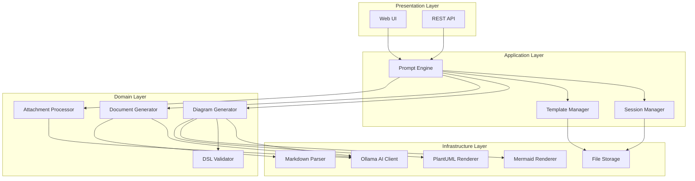

# Design Document: AI Diagram & Document Generator

## Overview

This design describes a local AI-powered tool that generates diagrams-as-code and structured technical documents from natural language prompts. The system uses a local LLM (via Ollama) to interpret user intent, classify requests, and produce output in Mermaid, PlantUML, or Markdown formats. Users interact through a web-based UI featuring a prompt input, code editor with syntax highlighting, visual diagram renderer, and split-pane Markdown editor. Iterative refinement is supported through session-based conversation history.

### Key Design Decisions

1. **Local-first AI inference via Ollama**: Keeps data private, avoids API costs and rate limits. Ollama exposes a REST API compatible with OpenAI-style chat completions, making it straightforward to integrate from TypeScript.
2. **TypeScript + Node.js backend**: Provides type safety, strong ecosystem support for Mermaid/Markdown parsing, and alignment with the web-based frontend.
3. **Mermaid.js for diagram rendering**: The `mermaid` npm package renders diagrams client-side from text definitions. PlantUML rendering uses `plantuml-wasm` (no Java dependency).
4. **markdown-it for Markdown rendering**: CommonMark-compliant parser/renderer with plugin support.
5. **Session-based architecture**: Each user conversation is a session with versioned history, enabling undo/redo and iterative refinement up to 50 exchanges.
6. **Template system stored as JSON**: Templates define structure (sections, layout, formatting rules) and are validated on save.

## Architecture

The system follows a layered architecture with clear separation between the presentation layer (UI), application layer (prompt routing, session management), domain layer (generators, processors), and infrastructure layer (AI inference, file storage, rendering engines).



### Request Flow

1. User submits prompt (with optional attachments and template selection) via UI or API
2. Prompt Engine validates input (length, content, attachments)
3. Attachment Processor extracts context from any attached files
4. Prompt Engine classifies request as diagram or document (or asks for clarification)
5. Request is routed to the appropriate generator with session context, template, and attachment context
6. Generator invokes Ollama for AI inference with structured prompt
7. Output is validated (DSL syntax check for diagrams, CommonMark check for documents)
8. Response is stored in session history and returned to the client
9. Client renders the output (diagram preview or Markdown preview)

## Components and Interfaces

### Prompt Engine

The central routing component that validates input, classifies requests, and orchestrates generation.

```typescript
interface PromptEngineConfig {
  maxPromptLength: number;        // 10,000 characters
  maxSessionExchanges: number;    // 50
  classificationConfidenceThreshold: number; // 0.7
}

interface GenerationRequest {
  prompt: string;
  sessionId?: string;
  diagramType?: DiagramType;
  outputFormat?: OutputFormat;
  templateId?: string;
  attachments?: Attachment[];
}

interface GenerationResponse {
  content: string;
  outputType: 'diagram' | 'document';
  format: OutputFormat | DocumentType;
  diagramType?: DiagramType;
  documentType?: DocumentType;
  sessionId: string;
  exchangeIndex: number;
}

interface PromptEngine {
  submitRequest(request: GenerationRequest): Promise<GenerationResponse>;
  classifyPrompt(prompt: string): Promise<ClassificationResult>;
  validateInput(request: GenerationRequest): ValidationResult;
}
```

### Diagram Generator

Converts natural language to diagram DSL code.

```typescript
type DiagramType =
  | 'flowchart'
  | 'er-diagram'
  | 'cloud-architecture'
  | 'sequence'
  | 'bpmn'
  | 'class-diagram'
  | 'network'
  | 'state-diagram'
  | 'data-flow';

type OutputFormat = 'mermaid' | 'plantuml';

interface DiagramGeneratorConfig {
  timeoutMs: number;             // 30,000
  defaultFormat: OutputFormat;    // 'mermaid'
}

interface DiagramGenerator {
  generate(
    prompt: string,
    context: GenerationContext
  ): Promise<DiagramResult>;
  
  refine(
    prompt: string,
    existingCode: string,
    context: GenerationContext
  ): Promise<DiagramResult>;
}

interface DiagramResult {
  code: string;
  format: OutputFormat;
  diagramType: DiagramType;
  isValid: boolean;
  validationErrors?: SyntaxError[];
}
```

### Document Generator

Converts natural language to structured Markdown documents.

```typescript
type DocumentType =
  | 'design-document'
  | 'documentation-outline'
  | 'sop'
  | 'api-documentation'
  | 'technical-specification';

interface DocumentGenerator {
  generate(
    prompt: string,
    context: GenerationContext
  ): Promise<DocumentResult>;
  
  refine(
    prompt: string,
    existingDocument: string,
    context: GenerationContext
  ): Promise<DocumentResult>;
}

interface DocumentResult {
  content: string;
  documentType: DocumentType;
  isValid: boolean;
  validationErrors?: MarkdownValidationError[];
}
```

### Session Manager

Manages conversation history and versioning for iterative refinement.

```typescript
interface Session {
  id: string;
  createdAt: Date;
  updatedAt: Date;
  exchanges: Exchange[];
  outputType: 'diagram' | 'document';
  currentVersion: number;
}

interface Exchange {
  index: number;
  prompt: string;
  response: GenerationResponse;
  timestamp: Date;
}

interface SessionManager {
  createSession(outputType: 'diagram' | 'document'): Session;
  getSession(sessionId: string): Session | null;
  addExchange(sessionId: string, prompt: string, response: GenerationResponse): void;
  undo(sessionId: string): Exchange | null;
  getHistory(sessionId: string): Exchange[];
}
```

### Template Manager

Manages built-in and custom templates.

```typescript
interface Template {
  id: string;
  name: string;
  type: 'diagram' | 'document';
  subType: DiagramType | DocumentType;
  isBuiltIn: boolean;
  structure: TemplateStructure;
  createdAt: Date;
  updatedAt: Date;
}

interface TemplateStructure {
  sections?: SectionDefinition[];
  layoutOrdering?: string[];
  formattingRules?: FormattingRule[];
  diagramConstraints?: DiagramConstraint[];
}

interface TemplateManager {
  listTemplates(filter?: TemplateFilter): Template[];
  getTemplate(id: string): Template | null;
  createTemplate(template: Omit<Template, 'id' | 'createdAt' | 'updatedAt' | 'isBuiltIn'>): Template;
  updateTemplate(id: string, updates: Partial<TemplateStructure>): Template;
  deleteTemplate(id: string): boolean;
  validateTemplate(structure: TemplateStructure): ValidationResult;
}
```

### Attachment Processor

Extracts context from uploaded files.

```typescript
interface Attachment {
  filename: string;
  mimeType: string;
  size: number;  // bytes
  content: Buffer;
}

interface AttachmentContext {
  filename: string;
  extractedText?: string;
  imageData?: Buffer;
  metadata: Record<string, string>;
}

interface AttachmentProcessor {
  process(attachment: Attachment): Promise<AttachmentContext>;
  validate(attachment: Attachment): ValidationResult;
  getSupportedTypes(): string[];
}
```

### DSL Validator

Validates generated diagram code against DSL syntax rules.

```typescript
interface SyntaxError {
  line: number;
  column: number;
  message: string;
  severity: 'error' | 'warning';
}

interface DSLValidator {
  validate(code: string, format: OutputFormat): ValidationResult;
  getFirstError(code: string, format: OutputFormat): SyntaxError | null;
}
```

### Diagram Renderer

Renders diagram code into visual output.

```typescript
interface RenderResult {
  svg: string;
  width: number;
  height: number;
}

interface DiagramRenderer {
  render(code: string, format: OutputFormat): Promise<RenderResult>;
  isValid(code: string, format: OutputFormat): boolean;
}
```

### REST API Interface

```typescript
// POST /api/generate
interface APIGenerateRequest {
  prompt: string;
  sessionId?: string;
  diagramType?: DiagramType;
  outputFormat?: OutputFormat;
  templateId?: string;
  attachments?: APIAttachment[];
}

interface APIAttachment {
  filename: string;
  contentBase64: string;
  mimeType: string;
}

// Response: 200, 400, 404, 500
interface APIGenerateResponse {
  content: string;
  outputType: 'diagram' | 'document';
  format: string;
  sessionId: string;
  diagramType?: DiagramType;
  documentType?: DocumentType;
}

// POST /api/sessions/:sessionId/undo
// GET /api/sessions/:sessionId
// GET /api/templates
// POST /api/templates
// PUT /api/templates/:templateId
// DELETE /api/templates/:templateId
```

## Data Models

### Session Storage (JSON file per session)

```json
{
  "id": "uuid-v4",
  "createdAt": "2024-01-15T10:30:00Z",
  "updatedAt": "2024-01-15T11:00:00Z",
  "outputType": "diagram",
  "exchanges": [
    {
      "index": 0,
      "prompt": "Create a flowchart showing user login",
      "response": {
        "content": "graph TD\n  A[Start] --> B[Enter Credentials]...",
        "outputType": "diagram",
        "format": "mermaid",
        "diagramType": "flowchart"
      },
      "timestamp": "2024-01-15T10:30:05Z"
    }
  ]
}
```

### Template Storage (JSON file per template)

```json
{
  "id": "uuid-v4",
  "name": "API Design Document",
  "type": "document",
  "subType": "api-documentation",
  "isBuiltIn": true,
  "structure": {
    "sections": [
      { "heading": "Overview", "level": 2, "required": true },
      { "heading": "Endpoints", "level": 2, "required": true },
      { "heading": "Authentication", "level": 2, "required": false },
      { "heading": "Error Codes", "level": 2, "required": true }
    ],
    "layoutOrdering": ["Overview", "Authentication", "Endpoints", "Error Codes"],
    "formattingRules": [
      { "rule": "use-tables-for-endpoints", "description": "Present endpoints in table format" }
    ]
  },
  "createdAt": "2024-01-01T00:00:00Z",
  "updatedAt": "2024-01-01T00:00:00Z"
}
```

### Supported File Types Registry

| Category | Extensions | MIME Types | Max Size |
|----------|-----------|------------|----------|
| Images | .png, .jpeg, .jpg | image/png, image/jpeg | 10 MB |
| Documents | .pdf | application/pdf | 10 MB |
| Text | .txt, .md | text/plain, text/markdown | 10 MB |
| Source Code | .py, .js, .ts, .java, .c, .cpp, .go, .rb, .rs, .html, .css, .json, .yaml, .yml, .xml, .sh | text/* | 10 MB |

### Validation Rules

| Rule | Constraint |
|------|-----------|
| Prompt length | 1–10,000 characters (non-whitespace required) |
| Attachments per prompt | 0–5 |
| Attachment size | ≤ 10 MB each |
| Session exchanges | ≤ 50 |
| Custom templates | ≤ 100 |
| Document size (editor) | ≤ 100,000 characters |
| Generation timeout (diagrams/docs) | 30 seconds |
| API timeout | 60 seconds |
| Render timeout (Mermaid) | 3 seconds |
| Re-render on edit | 2 seconds debounce |


## Correctness Properties

*A property is a characteristic or behavior that should hold true across all valid executions of a system — essentially, a formal statement about what the system should do. Properties serve as the bridge between human-readable specifications and machine-verifiable correctness guarantees.*

### Property 1: Prompt length validation boundary

*For any* string with non-whitespace content, it should be accepted by the Prompt Engine if and only if its length is between 1 and 10,000 characters (inclusive). Strings with length > 10,000 must be rejected with a validation error indicating the maximum allowed length.

**Validates: Requirements 1.3, 1.5**

### Property 2: Whitespace-only prompts are rejected

*For any* string composed entirely of whitespace characters (spaces, tabs, newlines, or any combination thereof), the Prompt Engine shall reject it with a validation error indicating the prompt must contain non-whitespace content.

**Validates: Requirements 1.4**

### Property 3: Classification always produces a valid result

*For any* valid non-empty, non-whitespace prompt within the length limit, the Prompt Engine classification shall return exactly one of: 'diagram', 'document', or 'ambiguous' — never an invalid or null value.

**Validates: Requirements 1.1**

### Property 4: Output format routing correctness

*For any* supported output format in the set {mermaid, plantuml}, when specified in a generation request, the response format field shall match the requested format. For any string not in the supported set, the system shall return an error listing supported formats.

**Validates: Requirements 3.3, 3.4**

### Property 5: Diagram output is valid plain text

*For any* generated diagram code output, the content shall be valid UTF-8 text containing only printable characters, newlines, and tabs — with no binary or control characters — ensuring compatibility with text-based version control.

**Validates: Requirements 3.5**

### Property 6: Session history preservation

*For any* session (diagram or document) and any sequence of N exchanges (where N ≤ 50), after adding all N exchanges the session history shall contain exactly N exchanges in chronological order, with each exchange's prompt and response matching what was submitted.

**Validates: Requirements 5.2, 8.2**

### Property 7: Session undo restores previous state

*For any* session with N exchanges (N ≥ 1), performing undo shall result in a session with N-1 exchanges where the last exchange is removed. Performing K sequential undos (K ≤ N) shall result in N-K exchanges. Undo on a session with 0 exchanges shall return an error.

**Validates: Requirements 5.3, 5.4, 8.3, 8.4**

### Property 8: Session exchange limit enforcement

*For any* session, the system shall accept exchanges up to the limit of 50. When the session contains exactly 50 exchanges, any additional submission shall be rejected with an error indicating the session exchange limit has been reached.

**Validates: Requirements 5.5, 5.6, 8.5, 8.6**

### Property 9: Attachment file type validation

*For any* file attachment, the Attachment Processor shall accept it if its extension is in the supported set (png, jpeg, jpg, pdf, txt, md, py, js, ts, java, c, cpp, go, rb, rs, html, css, json, yaml, yml, xml, sh) and reject it with an error listing supported types if the extension is not in the supported set.

**Validates: Requirements 10.3, 10.6**

### Property 10: Attachment file size validation

*For any* file attachment with a supported type, the Attachment Processor shall accept it if its size is ≤ 10 MB and reject it with a size limit error if its size exceeds 10 MB.

**Validates: Requirements 10.4**

### Property 11: Attachment count limit enforcement

*For any* prompt submission, the system shall accept 0 to 5 attachments and reject the submission if more than 5 attachments are provided.

**Validates: Requirements 10.5**

### Property 12: Text attachment content extraction round-trip

*For any* valid text-based file (txt, md, source code) with non-empty content, the text extracted by the Attachment Processor shall equal the original file content.

**Validates: Requirements 10.1**

### Property 13: Template type compatibility validation

*For any* template of type T (diagram or document) and subtype S, when selected for a generation request of a different type, the Template Manager shall return an incompatibility error. When types match, the template should be applied without error.

**Validates: Requirements 9.5**

### Property 14: Built-in template immutability

*For any* built-in template, update and delete operations shall be rejected. The Template Manager shall never allow modification or deletion of templates marked as built-in.

**Validates: Requirements 9.4**

### Property 15: Custom template validation and persistence round-trip

*For any* valid template structure (non-empty, with required fields), creating a custom template shall succeed, and retrieving it by ID shall return an equivalent template. Invalid or empty template structures shall be rejected with a validation error.

**Validates: Requirements 9.3, 9.6**

### Property 16: Custom template count limit

*For any* user, the Template Manager shall accept up to 100 custom templates. Attempting to create the 101st custom template shall be rejected.

**Validates: Requirements 9.3**

### Property 17: Diagram syntax error identification preserves last valid render

*For any* valid diagram code that successfully renders, if a syntax error is subsequently introduced at line N, the renderer shall identify the error at line N and retain the last successful render output unchanged.

**Validates: Requirements 4.3, 11.3**

### Property 18: Editor undo/redo round-trip

*For any* sequence of text edits in the code editor, performing undo shall reverse the most recent edit (restoring the previous content). Performing redo after undo shall re-apply the undone edit. The content after undo then redo shall equal the content before undo.

**Validates: Requirements 11.5**

### Property 19: API status code correctness

*For any* API request, the system shall return: 200 for successful generation, 400 for invalid input (empty prompt, oversized prompt, invalid parameters), 404 for a session ID that does not correspond to an existing session, and 500 for internal errors.

**Validates: Requirements 12.4, 12.7**

### Property 20: Document editor character limit enforcement

*For any* document content, the Markdown editor shall accept content up to 100,000 characters. When content exceeds 100,000 characters, the editor shall prevent further input and display a notification.

**Validates: Requirements 7.7**

### Property 21: CommonMark rendering validity

*For any* valid CommonMark document containing headings (levels 1–6), ordered/unordered lists, tables, fenced code blocks, and inline links, the Markdown renderer shall produce valid HTML output without errors.

**Validates: Requirements 7.4**

## Error Handling

### Error Categories

| Category | HTTP Status | Handling Strategy |
|----------|-------------|-------------------|
| Validation Error | 400 | Immediate rejection with descriptive message |
| Session Not Found | 404 | Return error with session ID reference |
| Generation Timeout | 408/500 | Abort after threshold, return timeout error |
| AI Inference Error | 500 | Retry once, then return error with reason |
| Rendering Error | N/A (client) | Display error indicator, retain last valid state |
| File Processing Error | 400 | Return specific reason (corrupt, encoding, password) |
| Rate/Limit Exceeded | 429/400 | Return error with limit details |

### Error Response Structure

```typescript
interface ErrorResponse {
  error: {
    code: string;           // machine-readable error code
    message: string;        // human-readable description
    details?: Record<string, unknown>;  // additional context
  };
  timestamp: string;
  requestId: string;
}
```

### Error Codes

| Code | Description |
|------|-------------|
| `PROMPT_EMPTY` | Prompt is empty or whitespace-only |
| `PROMPT_TOO_LONG` | Prompt exceeds 10,000 characters |
| `FORMAT_UNSUPPORTED` | Requested output format not supported |
| `DIAGRAM_TYPE_UNSUPPORTED` | Requested diagram type not recognized |
| `GENERATION_TIMEOUT` | Generation exceeded time limit |
| `GENERATION_FAILED` | AI could not produce valid output |
| `SESSION_NOT_FOUND` | Session ID does not match an existing session |
| `SESSION_LIMIT_REACHED` | Session has reached 50 exchange limit |
| `UNDO_NOT_AVAILABLE` | No previous version to restore |
| `ATTACHMENT_TOO_LARGE` | File exceeds 10 MB limit |
| `ATTACHMENT_TYPE_UNSUPPORTED` | File type not in supported list |
| `ATTACHMENT_EMPTY` | File is 0 bytes |
| `ATTACHMENT_CORRUPT` | File cannot be read (corrupt/encoding/protected) |
| `ATTACHMENT_LIMIT_EXCEEDED` | More than 5 attachments submitted |
| `TEMPLATE_NOT_FOUND` | Template ID does not exist |
| `TEMPLATE_INCOMPATIBLE` | Template type doesn't match request type |
| `TEMPLATE_INVALID` | Template structure is invalid or empty |
| `TEMPLATE_LIMIT_REACHED` | 100 custom template limit reached |
| `TEMPLATE_BUILTIN_READONLY` | Cannot modify or delete built-in template |
| `DOCUMENT_TOO_LONG` | Document exceeds 100,000 characters |
| `RENDER_SYNTAX_ERROR` | Diagram code has syntax errors |
| `RENDER_FAILED` | Valid syntax but rendering failed |
| `INTERNAL_ERROR` | Unexpected server error |

### Retry and Timeout Strategy

- **AI inference**: 1 automatic retry on transient failure, 30s timeout per attempt for diagrams/documents, 60s total for API requests
- **Rendering**: No retry; display error and retain last valid state
- **File processing**: No retry; return specific error immediately
- **Session operations**: No retry; operations are local and fast

### Graceful Degradation

- If Ollama is unavailable, the system returns a clear error indicating the AI backend is not reachable
- If Mermaid rendering fails for valid syntax, the raw code is still displayed in the editor
- If PlantUML WASM fails to load, the system falls back to displaying raw PlantUML code with an option to copy

## Testing Strategy

### Property-Based Testing

**Library**: [fast-check](https://github.com/dubzzz/fast-check) (TypeScript PBT library)

**Configuration**: Minimum 100 iterations per property test

Property-based tests will validate the 21 correctness properties defined above. Each test will be tagged with a comment referencing its design property:

```typescript
// Feature: ai-diagram-document-generator, Property 1: Prompt length validation boundary
```

**Key property test areas:**
- Input validation (prompts, attachments, templates)
- Session management (history, undo, limits)
- File type/size validation
- Template CRUD and type compatibility
- API status code correctness
- Text extraction round-trip
- Editor undo/redo round-trip

### Unit Tests

Unit tests complement property tests by covering:
- Specific classification examples (diagram vs document vs ambiguous prompts)
- Individual diagram type recognition
- Document type inference with representative prompts
- Error message formatting
- Template structure validation edge cases
- Corrupt file handling scenarios
- Timeout behavior (with mocked timers)

### Integration Tests

Integration tests verify end-to-end behavior with the AI backend:
- Full generation flow (prompt → classification → generation → validation → render)
- Session-based iterative refinement
- Template-applied generation
- File attachment context extraction and influence on output
- API endpoint contract testing
- Mermaid and PlantUML rendering pipeline

### Test Organization

```
tests/
├── unit/
│   ├── prompt-engine.test.ts
│   ├── diagram-generator.test.ts
│   ├── document-generator.test.ts
│   ├── session-manager.test.ts
│   ├── template-manager.test.ts
│   ├── attachment-processor.test.ts
│   └── dsl-validator.test.ts
├── property/
│   ├── input-validation.property.ts
│   ├── session-management.property.ts
│   ├── attachment-validation.property.ts
│   ├── template-management.property.ts
│   ├── api-status-codes.property.ts
│   ├── text-extraction.property.ts
│   └── editor-operations.property.ts
└── integration/
    ├── generation-flow.integration.ts
    ├── refinement-flow.integration.ts
    ├── api-endpoints.integration.ts
    └── rendering-pipeline.integration.ts
```

### Test Dependencies

- **fast-check**: Property-based testing framework (100+ iterations per property)
- **vitest**: Test runner and assertion library
- **msw** (Mock Service Worker): Mock Ollama API responses for deterministic unit/property tests
- **supertest**: HTTP assertions for API integration tests
