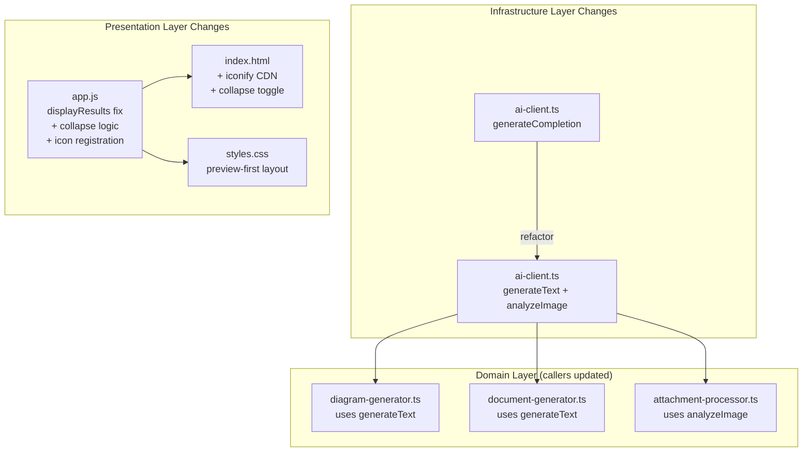

# Design Document: Enhanced Diagram Rendering

## Overview

This design covers four enhancements to the existing AI Diagram & Document Generator: (1) refactoring the AI client from a fallback chain to a purposeful provider split (Groq for text, Gemini for vision), (2) registering iconify icon packs for Mermaid architecture-beta diagrams, (3) restructuring the UI to preview-first layout with a collapsible code editor, and (4) fixing the display mode bug where diagram output incorrectly shows the document editor.

### Key Design Decisions

1. **Purposeful AI split over fallback**: Rather than treating Gemini as a safety net for Groq failures, each provider is used for its strength — Groq's speed for text generation, Gemini's multimodal capabilities for vision. This improves reliability by not masking configuration errors as fallback scenarios.
2. **Separate exported functions**: `generateText()` and `analyzeImage()` replace the single `generateCompletion()`, making call-site intent explicit and enabling type-safe vision parameters (image buffers, MIME types).
3. **Client-side icon registration**: Iconify packs are loaded via CDN and registered with Mermaid's `registerIconPacks` API at initialization time — no server-side changes needed for icon rendering.
4. **CSS-driven layout restructure**: The preview-first layout uses CSS restructuring and a toggle mechanism rather than JavaScript-driven layout calculations, keeping the approach consistent with the existing vanilla HTML/CSS/JS architecture.
5. **Bug fix via displayResults rewrite**: The existing override chain (`displayResults → displayResultsWithEditor → displayResultsWithPreview`) is fragile. The fix consolidates into a single clean `displayResults` function with explicit panel management.

## Architecture

The changes touch three layers of the existing architecture:



## Components and Interfaces

### AI Client Refactoring

The `src/infrastructure/ai-client.ts` module is refactored from a single `generateCompletion` export with internal fallback logic to two purpose-specific exports.

```typescript
// ─── Public Types ────────────────────────────────────────────────────────────

export interface ChatMessage {
  role: 'system' | 'user' | 'assistant';
  content: string;
}

export interface TextCompletionOptions {
  timeoutMs?: number;
  temperature?: number;
  maxTokens?: number;
}

export interface VisionAnalysisOptions {
  timeoutMs?: number;
  temperature?: number;
  maxTokens?: number;
}

export interface ImageInput {
  data: Buffer;
  mimeType: 'image/png' | 'image/jpeg';
}

// ─── Exported Functions ──────────────────────────────────────────────────────

/**
 * Generates text completion using Groq (text-only provider).
 * Retries once on transient error, then fails with provider-specific error.
 * Never falls back to Gemini.
 */
export async function generateText(
  messages: ChatMessage[],
  options?: TextCompletionOptions,
): Promise<string>;

/**
 * Analyzes an image using Gemini (vision provider).
 * Retries once on transient error, then fails with provider-specific error.
 * Never falls back to Groq.
 */
export async function analyzeImage(
  prompt: string,
  image: ImageInput,
  options?: VisionAnalysisOptions,
): Promise<string>;
```

**Retry Logic (shared pattern)**:
1. Call designated provider
2. If transient error (network, 5xx, 429) → retry once with same provider
3. If still fails → throw error with message: `"[Provider] [task_type] failed: [reason]"`
4. Non-transient errors (4xx auth, bad request) → fail immediately without retry

**Migration of callers:**
- `src/domain/diagram-generator.ts`: `generateCompletion(...)` → `generateText(...)`
- `src/domain/document-generator.ts`: `generateCompletion(...)` → `generateText(...)`
- `src/application/prompt-engine.ts`: `generateCompletion(...)` → `generateText(...)`
- `src/domain/attachment-processor.ts`: Image attachments use `analyzeImage(...)` instead of text-based description

### Icon Pack Registration

Icon packs are registered with Mermaid at initialization time in `public/app.js`. The iconify JSON is loaded from the CDN.

```javascript
// Icon pack registration for architecture-beta diagrams
const ICON_PACKS = ['aws', 'azure', 'gcp', 'logos'];

async function registerIconPacks() {
  if (typeof mermaid === 'undefined') return;

  for (const pack of ICON_PACKS) {
    try {
      const response = await fetch(
        `https://unpkg.com/@iconify-json/${pack}/icons.json`
      );
      if (response.ok) {
        const iconData = await response.json();
        mermaid.registerIconPacks([
          {
            name: pack,
            icons: iconData,
          },
        ]);
      }
    } catch {
      // Icon pack load failure is non-fatal; diagrams render with placeholders
      console.warn(`Failed to load icon pack: ${pack}`);
    }
  }
}
```

**Registration flow:**
1. `initMermaid()` is called (existing function)
2. After `mermaid.initialize(...)`, call `registerIconPacks()`
3. Icon packs load asynchronously — rendering waits for registration before processing architecture-beta diagrams
4. Failed icon loads are non-fatal: Mermaid renders with placeholder shapes and preserves node labels

**Validation check in renderer:**

```javascript
function isArchitectureBeta(code) {
  const firstLine = code.trim().split('\n')[0].trim();
  return firstLine.startsWith('architecture-beta');
}
```

Only architecture-beta diagrams trigger icon-aware rendering paths. Other diagram types bypass icon pack loading entirely.

### Preview-First UI Layout

**HTML changes** to `public/index.html` — restructure the results section:

```html
<!-- Results Area (restructured) -->
<section id="results-section" class="results-section" hidden>
  <div class="results-header">
    <h2 class="results-title">Generated Output</h2>
    <div class="results-meta">
      <span id="result-type-badge" class="badge"></span>
      <span id="result-format-badge" class="badge badge-secondary"></span>
    </div>
  </div>

  <!-- Diagram Preview Panel (hero position) -->
  <div id="diagram-preview-section" class="diagram-preview-panel" hidden>
    <!-- ... existing zoom/pan controls ... -->
  </div>

  <!-- Collapsible Code Editor -->
  <div id="code-editor-section" class="code-editor-section" hidden>
    <div class="code-editor-header">
      <h3 class="code-editor-title">Diagram Code Editor</h3>
      <div class="code-editor-actions">
        <button type="button" id="code-editor-toggle" class="code-editor-toggle"
                aria-expanded="false" aria-controls="code-editor-body">
          <svg class="toggle-chevron" width="16" height="16" viewBox="0 0 24 24"
               fill="none" stroke="currentColor" stroke-width="2" aria-hidden="true">
            <polyline points="6 9 12 15 18 9"/>
          </svg>
          <span class="toggle-text">Show Code</span>
        </button>
        <span id="editor-status" class="editor-status" aria-live="polite"></span>
      </div>
    </div>
    <div id="code-editor-body" class="code-editor-body collapsed">
      <!-- ... existing textarea and line numbers ... -->
    </div>
  </div>

  <!-- Raw code display (hidden when preview is active) -->
  <pre id="results-content" class="results-content" hidden><code></code></pre>

  <!-- Markdown Editor (for document output) -->
  <div id="markdown-editor-section" class="markdown-editor-section" hidden>
    <!-- ... existing markdown editor ... -->
  </div>
</section>
```

**CSS changes** for preview-first layout:

```css
/* Preview-first: diagram preview as hero element */
.diagram-preview-panel {
  margin-top: 16px;
  min-height: 400px;
}

.diagram-preview-viewport {
  min-height: 400px;
}

/* Collapsible code editor */
.code-editor-body.collapsed {
  display: none;
}

.code-editor-body.expanded {
  display: block;
}

.code-editor-toggle {
  display: flex;
  align-items: center;
  gap: 4px;
  background: none;
  border: none;
  cursor: pointer;
  font-size: 0.8rem;
  color: var(--color-text-secondary);
}

.code-editor-toggle[aria-expanded="true"] .toggle-chevron {
  transform: rotate(180deg);
}
```

### Display Mode Bug Fix

The current `displayResults` function is overridden twice through a chain of reassignments. The bug is that `_originalDisplayResults` shows the markdown editor for documents but doesn't explicitly hide it for diagrams in all code paths, and the diagram preview panel visibility depends on the order of these overrides.

**Root cause:** The override chain (`displayResults → displayResultsWithEditor → displayResultsWithPreview`) has the markdown editor shown by `displayResultsWithEditor` before `displayResultsWithPreview` can hide it. Additionally, the code editor section is shown but the preview panel relies on the subsequent override.

**Fix:** Replace the override chain with a single, unified `displayResults` function:

```javascript
/**
 * Display generation results, activating the correct panels based on outputType.
 * Single source of truth for panel visibility.
 */
function displayResults(data) {
  // Always show results section
  resultsSection.hidden = false;

  // Evaluate outputType FIRST to determine display mode
  const outputType = data.outputType;

  if (outputType === 'diagram') {
    // Diagram mode: Show preview (hero) + code editor (collapsed)
    // Hide markdown editor completely
    hideMarkdownEditor();

    // Show and render diagram preview
    const format = data.format || 'mermaid';
    showDiagramPreview(data.content, format);

    // Initialize code editor in collapsed state
    initCodeEditor(data.content, format);
    setCodeEditorCollapsed(true);

    // Hide raw results code block
    resultsContent.parentElement.hidden = true;

  } else if (outputType === 'document') {
    // Document mode: Show markdown editor
    // Hide diagram panels completely
    hideDiagramPreview();
    hideCodeEditor();

    // Show markdown editor
    showMarkdownEditor(data.content || '');

    // Hide raw results code block
    resultsContent.parentElement.hidden = true;

  } else {
    // Unknown type: show raw content only
    hideDiagramPreview();
    hideCodeEditor();
    hideMarkdownEditor();

    resultsContent.parentElement.hidden = false;
    resultsContent.textContent = data.content || '';
  }

  // Update badges
  resultTypeBadge.textContent = data.outputType || '';
  resultFormatBadge.textContent = data.format || data.diagramType || data.documentType || '';

  // Scroll results into view
  resultsSection.scrollIntoView({ behavior: 'smooth', block: 'start' });
}
```

**Collapse/expand logic:**

```javascript
function setCodeEditorCollapsed(collapsed) {
  const body = document.getElementById('code-editor-body');
  const toggle = document.getElementById('code-editor-toggle');
  if (!body || !toggle) return;

  if (collapsed) {
    body.classList.remove('expanded');
    body.classList.add('collapsed');
    toggle.setAttribute('aria-expanded', 'false');
    toggle.querySelector('.toggle-text').textContent = 'Show Code';
  } else {
    body.classList.remove('collapsed');
    body.classList.add('expanded');
    toggle.setAttribute('aria-expanded', 'true');
    toggle.querySelector('.toggle-text').textContent = 'Hide Code';
  }
}

function hideCodeEditor() {
  if (codeEditorSection) {
    codeEditorSection.hidden = true;
  }
}
```

## Data Models

No new data models are introduced. The existing `GenerationResponse` interface remains unchanged — the `outputType` field already carries the information needed for display mode decisions.

The AI client types change slightly:

```typescript
// New: ImageInput for vision tasks
export interface ImageInput {
  data: Buffer;
  mimeType: 'image/png' | 'image/jpeg';
}

// Existing types remain unchanged:
// ChatMessage, CompletionOptions (renamed to TextCompletionOptions)
```

## Error Handling

### AI Client Errors

| Scenario | Behavior |
|----------|----------|
| Groq transient error (5xx, network, 429) | Retry once, then throw `GroqTextGenerationError` |
| Groq non-transient error (401, 400) | Throw immediately with specific message |
| Gemini transient error (5xx, network, 429) | Retry once, then throw `GeminiVisionAnalysisError` |
| Gemini non-transient error (401, 400) | Throw immediately with specific message |
| Wrong provider for task type | Never occurs (enforced by separate functions) |

Error message format: `"[Groq|Gemini] [text generation|vision analysis] failed: [underlying error message]"`

### Icon Pack Loading Errors

| Scenario | Behavior |
|----------|----------|
| CDN unreachable | Log warning, continue without icons |
| Icon pack JSON malformed | Log warning, skip that pack |
| Specific icon unavailable | Mermaid renders placeholder shape with label |
| All icon packs fail | Architecture-beta diagrams render without icons (text labels only) |

### Display Mode Errors

| Scenario | Behavior |
|----------|----------|
| Unknown outputType | Show raw content in code block |
| Mermaid render failure | Show error banner, retain last valid render, show code editor |
| Missing data.content | Show empty preview area |

## Correctness Properties

*A property is a characteristic or behavior that should hold true across all valid executions of a system — essentially, a formal statement about what the system should do. Properties serve as the bridge between human-readable specifications and machine-verifiable correctness guarantees.*

### Property 1: Text tasks route exclusively to Groq

*For any* text generation task (diagram code generation, document generation, or prompt classification), the AI client SHALL invoke only the Groq provider and SHALL NOT invoke the Gemini provider, regardless of whether the request succeeds or fails.

**Validates: Requirements 1.1, 1.5, 1.6**

### Property 2: Vision tasks route exclusively to Gemini

*For any* image analysis task with a valid image input, the AI client SHALL invoke only the Gemini provider and SHALL NOT invoke the Groq provider, regardless of whether the request succeeds or fails.

**Validates: Requirements 1.2, 1.6**

### Property 3: Transient failure triggers exactly one retry on designated provider

*For any* task (text or vision) where the designated provider fails with a transient error (network error, HTTP 5xx, or HTTP 429), the AI client SHALL retry exactly once with the same provider before reporting failure. The total number of provider invocations SHALL be exactly 2.

**Validates: Requirements 1.3, 1.4**

### Property 4: Provider failure error includes provider name and task type

*For any* task where the designated provider fails permanently (after retry if transient), the thrown error message SHALL contain the provider name ("Groq" or "Gemini") and the task type ("text generation" or "vision analysis").

**Validates: Requirements 1.7**

### Property 5: Architecture-beta detection validates first line keyword

*For any* diagram code string, the icon-aware rendering path SHALL be triggered if and only if the first non-empty line starts with the `architecture-beta` keyword.

**Validates: Requirements 2.6**

### Property 6: Invalid icon identifiers produce rendered output with labels preserved

*For any* architecture-beta diagram code containing icon identifiers that are not in the registered packs, the renderer SHALL produce output (SVG or placeholder) that includes the node's text label.

**Validates: Requirements 2.5**

### Property 7: Diagram output activates preview and hides markdown editor

*For any* generation response where `outputType === 'diagram'`, the display mode SHALL set the Preview_Panel to visible, the Code_Editor section to visible (collapsed), and the Markdown_Editor to hidden.

**Validates: Requirements 4.1, 4.2**

### Property 8: Document output activates markdown editor and hides diagram panels

*For any* generation response where `outputType === 'document'`, the display mode SHALL set the Markdown_Editor to visible and both the Preview_Panel and Code_Editor to hidden.

**Validates: Requirements 4.3**

### Property 9: Code editor starts collapsed for diagram output

*For any* generation response with `outputType === 'diagram'`, the Code_Editor body SHALL be in collapsed state (CSS class `collapsed`, `aria-expanded` = `false`) immediately after `displayResults` completes.

**Validates: Requirements 3.2**

### Property 10: Collapsing code editor preserves preview panel visibility

*For any* state where both Preview_Panel and Code_Editor are visible, toggling the Code_Editor to collapsed SHALL NOT change the visibility of the Preview_Panel (it SHALL remain visible).

**Validates: Requirements 3.4, 3.5**


## Testing Strategy

### Property-Based Testing

**Library**: [fast-check](https://github.com/dubzzz/fast-check) (already in devDependencies)

**Configuration**: Minimum 100 iterations per property test

Property-based tests validate the 10 correctness properties defined above. Tests are organized by concern:

```
tests/property/
├── ai-client-routing.property.ts      (Properties 1–4)
├── icon-rendering.property.ts         (Properties 5–6)
└── display-mode.property.ts           (Properties 7–10)
```

**Key generators:**
- Random task types (text subtypes: diagram/document/classification, vision subtypes: image analysis)
- Random transient/non-transient error types
- Random diagram code strings (with/without `architecture-beta` prefix)
- Random generation responses with varying `outputType`, `content`, `format` fields
- Random icon identifiers (valid and invalid)

### Unit Tests

Unit tests cover specific examples and edge cases:

- AI client: Verify non-transient errors fail immediately (no retry)
- AI client: Verify timeout behavior per provider
- Icon registration: Verify CDN fetch failure is handled gracefully
- Display mode: Verify transition from document → diagram hides markdown first
- Display mode: Verify unknown outputType shows raw content
- Code editor toggle: Verify expand/collapse state transitions
- Architecture-beta detection: Edge cases (empty strings, whitespace-only, partial matches)

### Integration Tests

Integration tests verify end-to-end behavior:

- Full diagram generation flow with new `generateText()` function
- Image attachment processing with `analyzeImage()`
- Architecture-beta diagram rendering with icon packs loaded
- Display mode switching between diagram and document outputs in the browser

### Test Dependencies

- **fast-check**: Property-based testing (100+ iterations per property)
- **vitest**: Test runner (already configured)
- **JSDOM or happy-dom**: DOM simulation for display mode tests (via vitest environment)
- Mocked AI providers (no real API calls in unit/property tests)
